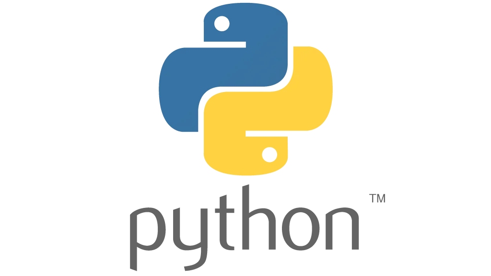

# Práctica 1 IA_P1 ---------------------------------
------------->

Repositorio para la clase de IA, Práctica 1 donde aprenderemos sobre la programación de Python como principiantes

## Alumno:   
Rolando Campos Loreto

## Registro: 
22310190

## Año: 
2025

## Profesor: 
Mauricio Alejandro Cabrera Arellano

**¡Gracias por ver!**

